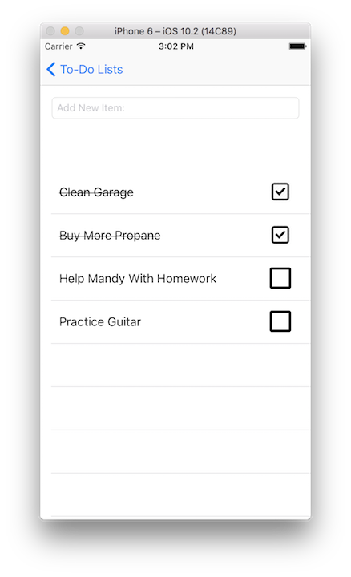

# To-Do-List
This to-do list was the first project for my GA iOS immersive course. You can add multiple tasks to each list and check off completed tasks. You can also add detailed notes to each task. There are 3 branches that persist data differently:

* CoreData
* Firebase
* User Defaults

## Screenshots
  
